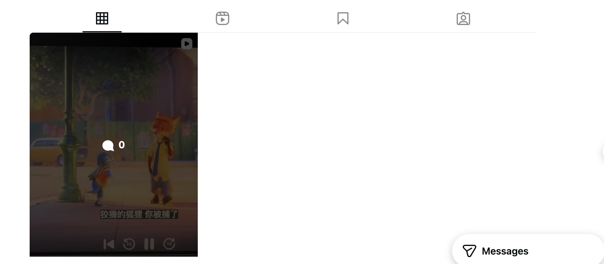
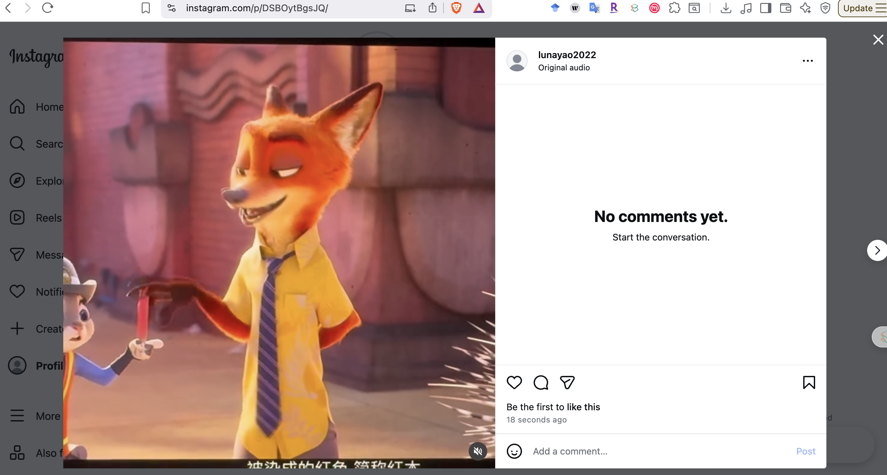
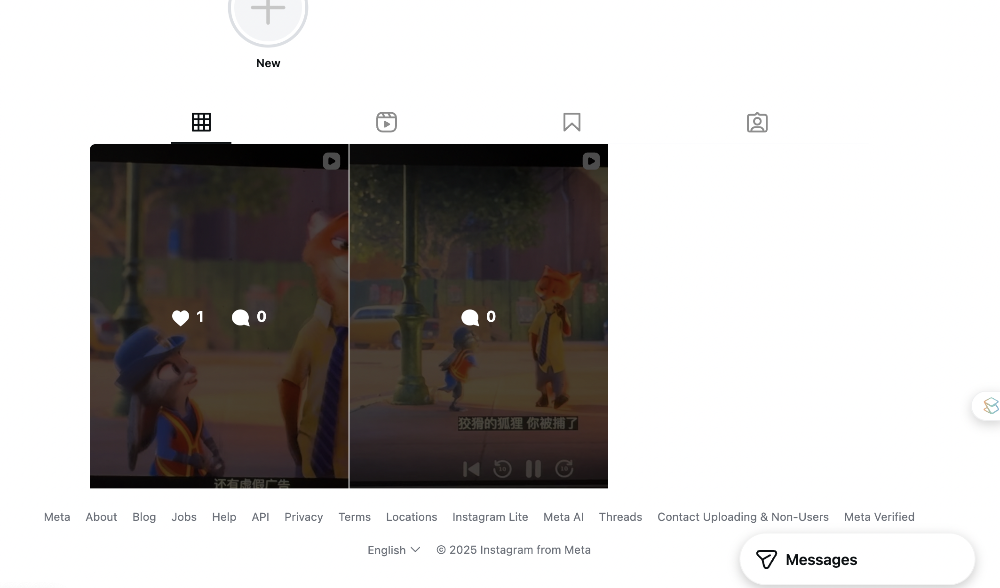
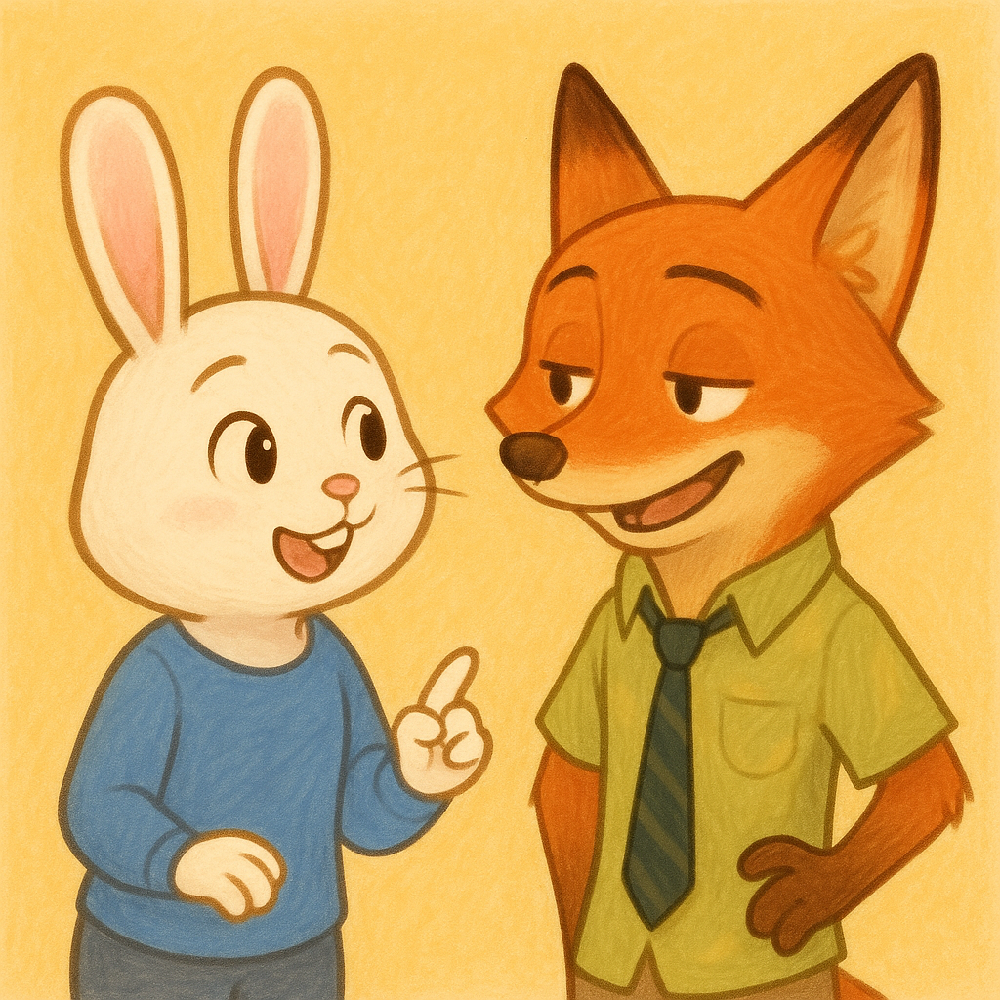

Name: Dixi Yao

# Platform Analysis
The platform I chose is Instagram.

> **Q**: How does the platform detect copyrighted content? (automated systems like Content ID, manual reporting, etc.)
>> **A**: Meta has a tool called [Right Manager](https://creators.facebook.com/tools/rights-manager/?locale=en_US) to detect to detect the copyright. The right holders for example users who upload the images and videos to the Ins will have a reference file (including information about the owner of image and video) and upload it to Meta DB. Then when someone else upload a copyrighted image or video, Meta will scan its database and see if it matches any owner's media. For Audio, Meta uses [Audio Magic](https://www.audiblemagic.com/).

> **Q**: What happens when content is flagged as potentially infringing?
>> **A**: The content will be potentially blocked, muted, or monitored according to Right Manager policy document: [link](https://www.facebook.com/rights_manager).

> **Q**: What is the appeals or counter-notification process?
>> **A**: Four steps according to the official policy document: 
>>> Step 1: "When a rights holder uses Rights Manager to action user content, the user receives a notification. The user will receive information via Support Inbox about who initiated the action, as well as details on how they can dispute. When they submit the dispute, the user selects the reason for their dispute and may provide additional details they wish to communicate to the rights holder." 

>>> Step 2: "After a dispute has been submitted, the rights holder receives a notification in Rights Manager that the action was disputed. In response, the rights holder may: i) uphold their original action, ii) release their claim to the content or iii) submit a takedown request. If the rights holder does not respond (in most cases, within seven days), the user wins the dispute."

>>> Step 3: If the rights holder upholds their claim on the content, the user has a second opportunity to appeal the action. If the user wants to submit this appeal, they must provide more information and justification for their appeal.

>>> Step 4: If the user appeals, the rights holder is notified and has a final chance to respond. The rights holder has two options: i) release their claim or ii) submit a takedown request for the content.

> **Q**: How does the platform handle monetization of content containing copyrighted material?
>> **A**: Instead of taking a video down, the rights holder can choose to leave it up and claim the ad revenue generated by that video. While for a creator who uses the copyrighted content, he/she cannot earn money.

> **Q**: Are there any special programs (e.g., YouTube's Content ID licensing agreements)?
>> **A**: The only special program instagram has is [Sound Collection](https://audiodrome.net/for-creators/instagram-music-licensing/#:~:text=Royalty%2Dfree%20library%20licenses%20travel,Collection%20for%20fast%2C%20native%20posts.). A library of instrumental tracks and sound effects owned by Meta. If I use these tracks, you keep your monetization (Ads on Reels) and I won't get a copyright strike.

# Fair Use Experiments
## Raw copyrighted clip
For the raw clip, I uploaded two disney file clips. One is 5 seconds and the other one is 10 seconds.

The 5-second clip succesful upload:

Time until detection: Never detected

Final outcome: Content stays up

The 30+-second clip succesful upload:

Time until detection: 3 hours

Final outcome: Will not be distributed others but still stays. No review.

Results screenshot:

I think for the disney content, the content is nevert detected and it stays up. So, I think for the longer part, it will be banned from being shown to others while the shorter one is fine and can stay up.

# AI-Generated Content Investigation
I tried to use ChatGPT to generate image.

For first image, I try to do direct reference. The prompt is *create an image of Nick and Judy in Disneyland Zootopia* and I input it to ChatGPT. The AI failed to generate. The platform respond is **This image generation request did not follow our content policy.**

For style mimicry, the prompt is *create an image of rabbit and fox in the style of Disneyland Zootopia*. The resposne is **This image generation request did not follow our content policy.**

For original create, I use "create an image including a cute rabbit and fox. They are like human and talking to each other*. The AI can generate image as following:

> **Q**: What does the AI tool's terms of service say about copyright?
>> **A**: OpenAI’s Terms of Service state that users own the output generated by OpenAI models, including images and text, except where prohibited by law. OpenAI does not claim copyright ownership over user outputs. Users must follow the usage rules, including no creating illegal, harmful, or IP-infringing content. OpenAI disclaims responsibility for potential copyright issues if outputs resemble copyrighted material due to training data.

> **Q**: Who owns the copyright to AI-generated content? (you, the AI company, the creators of training data, public domain/no one?)
>> **A**: I do not automatically own copyright over pure AI output. AI companies also do not own the copyright. Copyright may belong to no one unless the human makes creative modifications.

> **Q**: What is your platform's stated policy on AI-generated content?
>> **A**: Users may use, publish, and commercialize AI-generated content. Users must not misrepresent AI-generated content as human-generated if that would be misleading. Users must ensure they do not generate: Defamation, Copyright-violating contentm Harmful or illegal outputs, OpenAI may store prompts and outputs for safety purposes, unless using certain enterprise settings.

# Legal Analysis
For task2, we compare the 5-second clip and 30+ second clip. 
- Purpose and character of the use (transformative? commercial?): I think because we do not make any money on the Instagram as it is not commercial. So I can still post it but can not expose it so that others people won't see the content. 
- Nature of the copyrighted work (creative vs. factual?): It is creative copyright work so for the long clip, it will still be monitered.
- Amount and substantiality used: The 30 ones uses longer time and it receives on the publication. So the amount also affect the copyright. 
- Effect on the market for the original: Since we do not make money and it basiclalyy do not have any effect on the market. So even if I upload copyrighted work, ti can sill be there.

Gap Analysis: 
The law focus on qualitative facotrs rahterh than quantitative thresholds. So the short part can avoid the regulation of the raws, which create a brdiegt before the regulation and the actual results. The policy on the Meta allows right hodlers to choose between blocking and muting. However, I think it is not really implemented which means there is still some ways to steal the copyrighted work. In actual enforcement, the change and detecteion is not send from Meta to the customer.  I think in the actual enforcement, there is a weaker link for thec opyrighted image and some copyright infrigement work can still exist on the market.

# Appendix
AI tools are used to help quick search links to several questions. 